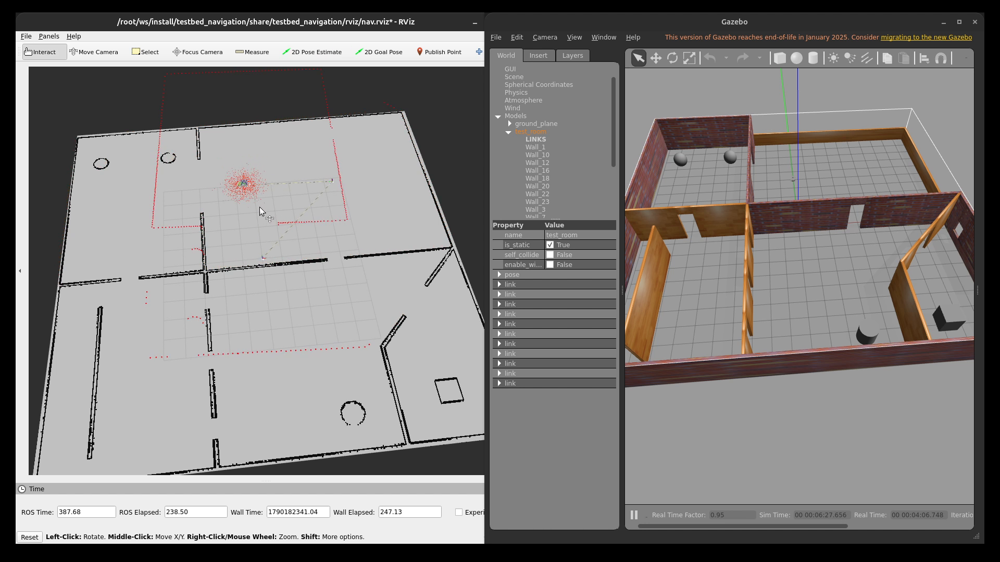
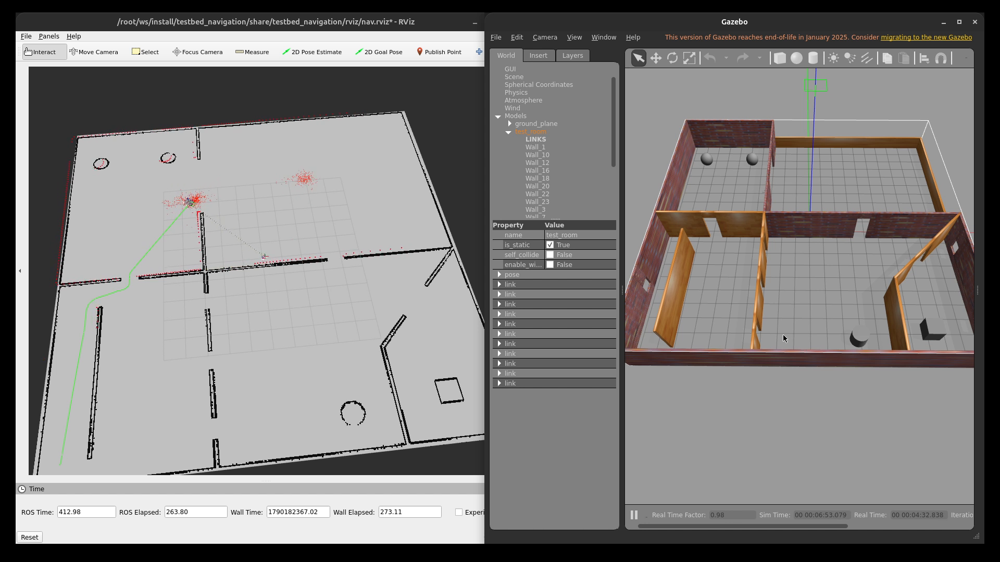
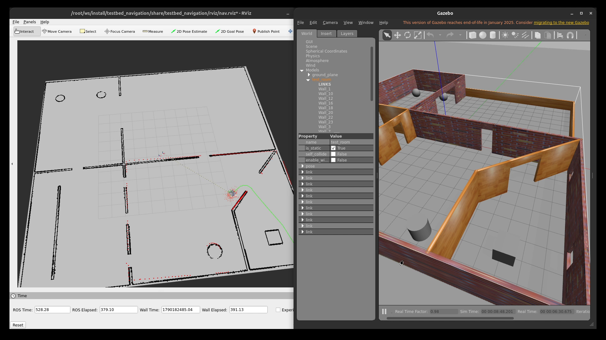

# Level 1: ROS2 Navigation Assignment - Amin Ahmed G

I fixed the bugs in the starter code and wrote the `testbed_navigation` package. It brings up map_server, AMCL and the Nav2 servers from separate launch files, without nav2_bringup.

## Demo

[](https://youtu.be/YqaQvPbJf5Q)

| Localization (wrong initial pose) | AMCL correcting | Navigation |
|---|---|---|
|  |  |  |

## Environment

- ROS 2 Humble, Gazebo 11 (classic), RViz2
- My laptop runs Ubuntu 24.04 (Jazzy), so everything ran in an `osrf/ros:humble-desktop` Docker container
- I used CycloneDDS as the FAQ suggested. Also tested with the default FastDDS on a fresh clone, works fine

## Setup

```bash
mkdir -p ~/assignment_ws/src && cd ~/assignment_ws/src
git clone -b testbed-navigation https://github.com/Amin-Ahmed-G/level01_ros_assignment.git
cd ~/assignment_ws
sudo apt update
rosdep install --from-paths src --ignore-src -y
colcon build --symlink-install
source install/setup.bash
```

## How to run

Separate terminal for each, in this order:

```bash
# terminal 1 - simulation (gui:=false runs gazebo headless)
ros2 launch testbed_bringup testbed_full_bringup.launch.py \
  rvizconfig:=$(ros2 pkg prefix testbed_navigation)/share/testbed_navigation/rviz/nav.rviz
# terminal 2 - map
ros2 launch testbed_navigation map_loader.launch.py
# terminal 3 - localization
ros2 launch testbed_navigation localization.launch.py
# terminal 4 - navigation
ros2 launch testbed_navigation navigation.launch.py
```

Then give a goal with 2D Goal Pose in RViz. The initial pose is already set to the spawn point (0, 5, 0), if the particles look off just use 2D Pose Estimate. If you restart the sim, restart all four (see Challenges).

## Package layout

```
testbed_navigation/
├── config/
│   ├── amcl_params.yaml
│   └── nav2_params.yaml
├── launch/
│   ├── map_loader.launch.py
│   ├── localization.launch.py
│   └── navigation.launch.py
└── rviz/
    └── nav.rviz
```

## Approach

I split it into three launch files, each with its own lifecycle manager, so I could bring up one stage at a time: map first, check it in RViz, then AMCL, then Nav2. When something broke it was easy to tell which part.

### Map loader

`nav2_map_server` + `lifecycle_manager_map`. The map is loaded from the installed testbed_bringup share folder, so it works from any workspace. Another map can be passed with `map:=<path>`.

### Localization

AMCL with `nav2_amcl::DifferentialMotionModel` (diff drive robot) and the default `likelihood_field` laser model. Base frame is `base_footprint`.

- `laser_max_range` 12 m, same as the lidar
- `max_beams` 60 out of 300, enough for AMCL and cheaper
- 500 to 2000 particles
- initial pose at the spawn point (0, 5, 0)

Compared against the robot pose from Gazebo, the error was about 7 cm.

### Navigation

- Planner: NavFn (Dijkstra). Small map, point to point goals, didn't need anything more.
- Controller: Regulated Pure Pursuit, max 0.3 m/s. It suits diff drive and slows down in tight turns and near walls. I looked at DWB but it has a lot more to tune.
- velocity_smoother between the controller and the robot so speed changes aren't sudden (controller -> `cmd_vel_nav` -> smoother -> `cmd_vel`).
- behavior_server with spin, backup and wait for recoveries.
- bt_navigator with the default tree. Humble needs `plugin_lib_names`, I listed only the 13 BT nodes the default trees use.

### Costmaps

- `robot_radius` 0.25 m. The farthest point of the base mesh from base_footprint is 0.245 m, rounded up
- inflation 0.45 m to keep paths off the walls
- obstacle / raytrace range 11.5 / 12 m, based on the lidar range
- local costmap: 4x4 m rolling window in `odom`, since `odom` doesn't jump when AMCL corrects
- global costmap: static layer + obstacle layer, in `map`

## Bugs found

6 bugs and 5 smaller fixes, each in its own commit. Details (file, problem, fix, how I checked) are in [BUGS.txt](BUGS.txt).

1. `ament_package` without `()` in testbed_description's CMakeLists.txt. Nothing built.
2. LiDAR max range was 1.5 m. The nearest wall is ~3.4 m from spawn so the scan was empty. Changed to 12 m.
3. Map yaml pointed to `wrong_path_testbed_world.pgm` instead of `testbed_world.pgm`.
4. testbed_bringup didn't install `maps/`, so the map wasn't in the share folder.
5. `base_footprint` was ~6 cm off the rotation centre. Moved it to the middle of the wheel axle.
6. Missing `exec_depend`s (xacro, gazebo_ros, gazebo_plugins, joint_state_publisher...), so rosdep didn't install them on a clean setup. I only caught gazebo_plugins when I tested a fresh clone in a new container.

Smaller fixes: removed the ROS1 `libgazebo_ros_control.so` plugin and a stray `>` in the IMU block, `use_sim_time` for robot_state_publisher, installed the gazebo `models/` folder, `Gazebo/Silver` -> `Gazebo/Grey` (Silver doesn't exist in Gazebo 11).

## Challenges

### Particle cloud not showing in RViz

AMCL was running but no particles showed up. It was a QoS mismatch: AMCL publishes `/particle_cloud` as best effort and the RViz display was set to reliable. Setting the display to Best Effort fixed it.

### bt_navigator wouldn't activate

I only needed navigate_to_pose, but bt_navigator loads the navigate_through_poses tree as well, and that one needs `compute_path_through_poses` and `remove_passed_goals`. It stayed inactive until I added those two to `plugin_lib_names`.

### base_footprint in the wrong place

Turning the robot in place with teleop, base_footprint moved in a ~6 cm circle in RViz instead of staying on the spot, so it wasn't on the rotation axis. I moved the joint to the midpoint of the two wheels and the drift went from ~5 cm to ~0.1 cm.

### Restarting only Gazebo breaks Nav2

Restarting just the sim made the clock jump back, AMCL kept the old pose and the controller failed with "patience exceeded". Now I restart all four launches in order.

### Docker

Humble had to run in Docker, and early on I mixed up host and container paths a few times. I also tried passing the GPU into the container. It rendered, but the windows were black under Wayland, so I went back to software rendering and mostly ran Gazebo with `gui:=false`.

## Contact Info
 - Name: Amin Ahmed G
 - Contact number: +91 8122241705
 - Email Address: aminahmedg2005@gmail.com
